# 🔥 BRUTAL FITNESS — Sistema de Gestión para Gimnasio 🏋️‍♂️

Sistema web integral diseñado para modernizar y digitalizar la administración operativa del gimnasio **BRUTAL FITNESS** (ubicado en el **Jirón José Santos Chocano, Distrito de Jesús Nazareno, Ayacucho**), aplicando la **arquitectura por capas** con **Spring Boot**, **Spring Data JPA**, **Thymeleaf**, **MySQL** y **PostgreSQL**.

---

## 📌 Problemática y Solución

### El Problema
El control tradicional en cuadernos o libretas físicas genera:
* Pérdida o deterioro de la información histórica de clientes y pagos.
* Errores de registro y lentitud al atender en recepción.
* Dificultad para calcular y controlar las fechas de vencimiento de membresías.
* Falta de métricas en tiempo real sobre ingresos y asistencias diarias.

### La Solución
Una plataforma web rápida, segura y automatizada que gestiona clientes, planes de membresía con cálculo dinámico de vigencia, cobros y registro de asistencias en tiempo real.

---

## 🏗️ Arquitectura del Sistema

El proyecto sigue una arquitectura en capas desacoplada y estandarizada:

```
[ Vista (Thymeleaf / HTML5 / Bootstrap 5 / JS) ]
                     ↕
   [ Controller (Spring Web MVC) ]
                     ↕
   [ Service (Lógica de Negocio / Interfaces + Impl) ]
                     ↕
   [ Repository (Spring Data JPA / Queries JPQL) ]
                     ↕
       [ Entity (Modelos JPA) ] ↔ [( Base de Datos MySQL )]
```

---

## 🗄️ Base de Datos y Modelo Entidad-Relación (20 Tablas Normalizadas)

El sistema utiliza **MySQL 8.x** / **PostgreSQL 14+** con el esquema `gym_db`. La base de datos está completamente normalizada en **Tercera Forma Normal (3FN)** con soporte para relaciones **1:N**, **N:M**, maestros-detalle y catálogos paramétricos:

### Diagrama Entidad-Relación (ERD Completo)

```mermaid
erDiagram
    CLIENTE ||--o{ MEMBRESIA : "contrata"
    PLAN_MEMBRESIA ||--o{ MEMBRESIA : "clasifica"
    CLIENTE ||--o{ PAGO : "realiza"
    CLIENTE ||--o{ ASISTENCIA : "registra entrada"
    CLIENTE ||--o{ SEGUIMIENTO_FISICO : "recibe evaluaciones"
    ENTRENADOR ||--o{ SEGUIMIENTO_FISICO : "realiza"
    CLIENTE ||--o{ RUTINA : "tiene asignada"
    ENTRENADOR ||--o{ RUTINA : "diseña"
    RUTINA ||--|{ RUTINA_DETALLE : "contiene"
    EJERCICIO ||--o{ RUTINA_DETALLE : "se ejecuta en"
    CATEGORIA_PRODUCTO ||--o{ PRODUCTO : "agrupa"
    VENTA ||--|{ VENTA_DETALLE : "contiene"
    PRODUCTO ||--o{ VENTA_DETALLE : "se vende en"
    CLIENTE ||--o{ VENTA : "compra en tienda"
    DISCIPLINA ||--o{ CLASE_GRUPAL : "define"
    ENTRENADOR ||--o{ CLASE_GRUPAL : "dicta"
    CLASE_GRUPAL ||--o{ RESERVA_CLASE : "recibe"
    CLIENTE ||--o{ RESERVA_CLASE : "reserva cupo"
    CASILLERO ||--o{ ALQUILER_CASILLERO : "se arrienda en"
    CLIENTE ||--o{ ALQUILER_CASILLERO : "alquila"
    CLIENTE ||--o| USUARIO : "cuenta de acceso"
    ENTRENADOR ||--o| USUARIO : "cuenta de staff"

    CLIENTE {
        bigint id PK "Auto Increment"
        varchar(15) dni UK "DNI"
        varchar(100) nombres "Nombres"
        varchar(100) apellidos "Apellidos"
        int edad "Edad"
        varchar(20) telefono "Teléfono"
        varchar(100) correo "Email"
        date fecha_inscripcion "Fecha"
    }

    PLAN_MEMBRESIA {
        bigint id PK "Auto Increment"
        varchar(100) nombre UK "Nombre del plan"
        int duracion_dias "Duración"
        decimal(10_2) precio_base "Precio base en S/"
        boolean acceso_total "VIP o restringido"
    }

    MEMBRESIA {
        bigint id PK "Auto Increment"
        bigint cliente_id FK
        bigint plan_id FK
        enum tipo "DIARIO, SEMANAL, MENSUAL, TRIMESTRAL, ANUAL, PERSONALIZADA"
        date fecha_inicio "Inicio"
        date fecha_vencimiento "Vencimiento"
        enum estado "ACTIVA / VENCIDA"
    }

    PAGO {
        bigint id PK "Auto Increment"
        bigint cliente_id FK
        decimal(10_2) monto "Monto en S/"
        date fecha "Fecha"
        enum metodo_pago "EFECTIVO, TARJETA, YAPE, PLIN, TRANSFERENCIA"
        date proxima_fecha_pago "Próximo cobro"
    }

    ASISTENCIA {
        bigint id PK "Auto Increment"
        bigint cliente_id FK
        datetime fecha_hora "Timestamp de entrada"
    }

    SEGUIMIENTO_FISICO {
        bigint id PK "Auto Increment"
        bigint cliente_id FK
        bigint entrenador_id FK
        date fecha_registro "Fecha"
        double peso_kg "Peso corporal"
        double altura_cm "Estatura"
        double porcentaje_grasa "% Grasa"
        double masa_muscular "Masa muscular kg"
        varchar(100) objetivo "Meta física"
    }

    ENTRENADOR {
        bigint id PK "Auto Increment"
        varchar(15) dni UK "DNI"
        varchar(100) nombres "Nombres"
        varchar(100) apellidos "Apellidos"
        varchar(100) especialidad "Especialidad"
        varchar(20) telefono "Teléfono"
        varchar(100) correo "Email"
        varchar(20) estado "ACTIVO / INACTIVO"
    }

    USUARIO {
        bigint id PK "Auto Increment"
        varchar(50) username UK "Usuario / DNI"
        varchar(255) password "BCrypt Hash"
        varchar(100) nombre "Nombre completo"
        varchar(30) rol "ROLE_ADMIN, ROLE_RECEPCIONISTA, ROLE_ENTRENADOR, ROLE_CLIENTE"
        boolean activo "Estado"
        bigint cliente_id FK
        bigint entrenador_id FK
    }

    EJERCICIO {
        bigint id PK "Auto Increment"
        varchar(100) nombre UK "Nombre"
        varchar(50) grupo_muscular "Pecho, Espalda, Piernas..."
        varchar(30) nivel_dificultad "Nivel"
    }

    RUTINA {
        bigint id PK "Auto Increment"
        bigint cliente_id FK
        bigint entrenador_id FK
        varchar(100) nombre "Plan"
        varchar(50) dia_semana "Día"
        varchar(50) nivel "Nivel"
    }

    RUTINA_DETALLE {
        bigint id PK "Auto Increment"
        bigint rutina_id FK
        bigint ejercicio_id FK
        int series "Series"
        int repeticiones "Repeticiones"
        double peso_sugerido_kg "Carga sugerida"
        int descanso_segundos "Descanso"
    }

    CATEGORIA_PRODUCTO {
        bigint id PK "Auto Increment"
        varchar(100) nombre UK "Suplementos, Bebidas..."
    }

    PRODUCTO {
        bigint id PK "Auto Increment"
        bigint categoria_id FK
        varchar(50) codigo_barra UK "Código de barra"
        varchar(120) nombre "Nombre"
        decimal(10_2) precio_compra "Costo"
        decimal(10_2) precio_venta "P. Venta"
        int stock_actual "Stock"
        int stock_minimo "Alerta stock"
    }

    VENTA {
        bigint id PK "Auto Increment"
        bigint cliente_id FK
        bigint usuario_id FK
        datetime fecha_hora "Fecha y hora"
        decimal(10_2) total "Total en S/"
        varchar(30) metodo_pago "Método"
    }

    VENTA_DETALLE {
        bigint id PK "Auto Increment"
        bigint venta_id FK
        bigint producto_id FK
        int cantidad "Cant."
        decimal(10_2) precio_unitario "P. Unitario"
        decimal(10_2) subtotal "Subtotal"
    }

    DISCIPLINA {
        bigint id PK "Auto Increment"
        varchar(100) nombre UK "Spinning, Crossfit, Boxeo..."
        varchar(30) intensidad "Intensidad"
    }

    CLASE_GRUPAL {
        bigint id PK "Auto Increment"
        bigint disciplina_id FK
        bigint entrenador_id FK
        varchar(50) salon "Sala"
        date fecha "Fecha"
        time hora_inicio "Inicio"
        time hora_fin "Fin"
        int cupo_maximo "Aforo"
    }

    RESERVA_CLASE {
        bigint id PK "Auto Increment"
        bigint clase_id FK
        bigint cliente_id FK
        datetime fecha_reserva "Fecha"
        varchar(30) estado "CONFIRMADA / ASISTIO"
    }

    CASILLERO {
        bigint id PK "Auto Increment"
        varchar(20) numero UK "N° Locker"
        varchar(100) ubicacion "Vestidor"
        varchar(30) estado "DISPONIBLE / OCUPADO"
    }

    ALQUILER_CASILLERO {
        bigint id PK "Auto Increment"
        bigint casillero_id FK
        bigint cliente_id FK
        date fecha_inicio "Inicio"
        date fecha_fin "Fin"
        decimal(10_2) costo "Costo mensual"
        varchar(30) estado "ACTIVO"
    }
```



### Scripts SQL Disponibles (20 Tablas + Datos de Prueba)
El proyecto incluye scripts DDL normalizados y datos de prueba listos para importar:
* 👉 **MySQL 8.x**: [`database/gym_db.sql`](database/gym_db.sql)
* 👉 **PostgreSQL 14+**: [`database/gym_db_postgresql.sql`](database/gym_db_postgresql.sql)

---

## 🔐 Seguridad y Control de Acceso por Roles (RBAC)

El sistema integra **Spring Security 6** con protección CSRF, sesiones seguras y encriptación de contraseñas con **BCrypt**.

### 👥 Cuentas de Acceso Preconfiguradas

| Rol | Usuario | Contraseña | Vistas y Alcance Permitido |
| :--- | :--- | :--- | :--- |
| 👑 **`ROLE_ADMIN`** *(Admin General)* | `admin` | `admin123` | **Acceso Total**: Panel de control, finanzas, staff de entrenadores, gestión de usuarios, clientes, membresías y cobros. |
| 💼 **`ROLE_RECEPCIONISTA`** *(Recepción)* | `recepcion` | `recepcion123` | **Atención al Cliente**: Registro de clientes, cobro de pagos, emisión de membresías y control de asistencias. |
| 🏋️‍♂️ **`ROLE_ENTRENADOR`** *(Instructor)* | `entrenador` | `entrenador123` | **Gestión Deportiva**: Evaluaciones antropométricas, progreso físico, asistencias y alumnos asignados. |
| 👤 **`ROLE_CLIENTE`** *(Socio / Alumno)* | `72345678` | `cliente123` | **Portal del Socio (`/portal/mi-cuenta`)**: Días de membresía restantes, historial de pagos y evolución de medidas e IMC. |

---

## 🚀 Módulos y Funcionalidades

### 1. 📊 Panel de Control (Dashboard General)
* **Indicadores en tiempo real**:
  * Total de clientes registrados.
  * Membresías activas.
  * Membresías próximas a vencer (alerta a 7 días).
  * Membresías vencidas.
  * Total de ingresos recaudados en el mes en curso (S/).
  * Asistencias registradas en el día.
  * Total de entrenadores activos en staff.
  * Fichas antropométricas y evaluaciones de progreso registradas.

### 2. 👤 Portal Exclusivo del Socio (`/portal/mi-cuenta`)
* Dashboard personal del socio autenticado:
  * Semáforo de vigencia de su membresía y contador de **días restantes**.
  * Historial cronológico de todos sus pagos realizados y métodos usados.
  * Ficha de evolución física (peso, estatura, IMC, % grasa, masa muscular y notas del entrenador).
  * Registro de todas sus asistencias al gimnasio.

### 3. 👥 Módulo de Clientes (`/clientes`)
* Registro, edición y eliminación de clientes.
* Validación de DNI único y datos de contacto (teléfono, edad).
* Fecha de inscripción inicializada automáticamente con la fecha actual.
* Buscador interactivo por nombre o apellido.

### 4. 💳 Módulo de Membresías (`/membresias`)
* **Planes soportados**: `DIARIO`, `SEMANAL`, `MENSUAL`, `TRIMESTRAL`, `ANUAL` y `PERSONALIZADA`.
* **Cálculo Automático de Vigencia**:
  * Al seleccionar el plan y la fecha de inicio, la fecha de vencimiento se calcula automáticamente tanto en la interfaz (JavaScript en tiempo real) como en el backend.
  * En modo `PERSONALIZADA`, permite ingresar libremente cualquier fecha manual.
* **Control de Estados**: Actualización automática entre `ACTIVA` y `VENCIDA` según la fecha actual.

### 5. 💵 Módulo de Pagos y Boletas PDF (`/pagos`)
* Registro de cobros asociados a un cliente y su método de pago (`EFECTIVO`, `TARJETA`, `YAPE`, `PLIN`, `TRANSFERENCIA`).
* Pre-llenado inteligente de fecha de pago y proyección automática de la próxima fecha de pago.
* **🧾 Emisión y Descarga de Boleta en PDF**: Generación en tiempo real de comprobantes oficiales con OpenPDF para cada cobro.
* Cálculo consolidado de recaudación mensual mediante consultas agregadas (`SUM`).

### 6. ⏱️ Módulo de Asistencias y Check-in Rápido (`/asistencias`)
* Registro de entrada por cliente con estampación de fecha y hora exacta (`LocalDateTime`).
* **⚡ Modo Molinete / Pantalla Completa (`/asistencias/control-acceso`)**: Validación instantánea por DNI o lector de código de barras con semáforo visual en vivo (🟢 *Acceso Concedido* / 🔴 *Acceso Denegado*).

### 7. 🏋️‍♂️ Módulo de Entrenadores y Staff (`/entrenadores`)
* Registro del staff de entrenadores y personal trainers de **BRUTAL FITNESS**.
* Control de especialidades (*Musculación, Crossfit, Funcional, Calistenia, Nutrición*), contacto y estado (`ACTIVO` / `INACTIVO`).

### 8. 📋 Módulo de Rutinas de Entrenamiento (`/rutinas`)
* Asignación de rutinas semanales por día muscular (Pecho, Espalda, Piernas, etc.), nivel y detalle de ejercicios.
* Visualización directa para los socios en su portal móvil.

### 9. 📈 Módulo de Progreso Físico (`/seguimientos`)
* Fichas de evaluación antropométrica por cliente.
* Registro de peso corporal, estatura, cálculo automático de **IMC**, porcentaje de grasa y masa muscular.
* Gráfico interactivo con **Chart.js** en el portal del socio.

### 10. 👥 Módulo de Gestión de Usuarios y Roles (`/usuarios`)
* Panel exclusivo para el Administrador General.
* Creación de usuarios, cambio de roles, activación/desactivación de cuentas y encriptación BCrypt.

### 11. 🎬 Biblioteca Visual de Ejercicios y Técnica (`/ejercicios`)
* Integración del dataset internacional de ejercicios (*hasaneyldrm/exercises-dataset*).
* Catálogo visual interactivo con **animaciones GIF en vivo** de la técnica correcta.
* Filtros dinámicos por grupo muscular (*Pecho, Espalda, Piernas, Hombros, Brazos, Core*) y buscador instantáneo.
* Modales emergentes con instrucciones paso a paso de postura y respiración.
* Integración directa con las rutinas de los socios en su portal móvil.

---

## 🛠️ Stack Tecnológico

| Capa / Herramienta | Tecnología |
| :--- | :--- |
| **Lenguaje** | Java 17+ (Compatible con JDK 17, 21 y versiones superiores) |
| **Framework Backend** | Spring Boot 3.3.4 (Spring Web MVC, Spring Data JPA, Spring Validation) |
| **Motor de Plantillas** | Thymeleaf + HTML5 + JavaScript Vanilla |
| **Estilos UI** | Bootstrap 5.3.3 + CSS3 personalizado |
| **Base de Datos** | MySQL 8.x / PostgreSQL 14+ (Soporte Dual con Hibernate ORM) |
| **Gestor de Proyecto** | Apache Maven |

---

## ⚙️ Configuración y Ejecución Local

### 1. Requisitos Previos
* Java Development Kit (JDK 17 o superior).
* Servidor de Base de Datos: **MySQL** (puerto `3306`) o **PostgreSQL** (puerto `5432`).
* Apache Maven (o Maven Wrapper).

### 2. Configuración de Base de Datos

#### Opción A: Usando MySQL (Por Defecto)
En `backend/src/main/resources/application.properties`:
```properties
spring.datasource.url=jdbc:mysql://localhost:3306/gym_db?createDatabaseIfNotExist=true&serverTimezone=America/Lima
spring.datasource.username=root
spring.datasource.password=root
```
*(Importar script opcional: `mysql -u root -p gym_db < database/gym_db.sql`)*

#### Opción B: Usando PostgreSQL
El proyecto cuenta con el perfil `postgres` listo en `backend/src/main/resources/application-postgres.properties`:
```properties
spring.datasource.url=jdbc:postgresql://localhost:5432/gym_db
spring.datasource.username=postgres
spring.datasource.password=postgres
```
*(Importar script opcional: `psql -U postgres -d gym_db -f database/gym_db_postgresql.sql`)*

### 3. Compilar y Ejecutar

```bash
# Compilar el proyecto completo desde la raíz
mvn clean compile

# Ejecutar el servidor con MySQL (por defecto)
mvn spring-boot:run -pl backend

# O ingresar a la carpeta backend:
cd backend
mvn spring-boot:run

# Ejecutar con PostgreSQL (usando el perfil postgres)
mvn spring-boot:run -pl backend -Dspring-boot.run.profiles=postgres
```

### 4. Acceder al Sistema
Abre tu navegador en: **[http://localhost:8080](http://localhost:8080)**

---

## 📁 Organización del Proyecto (Backend, Frontend y Base de Datos)

El proyecto está organizado de manera modular y desacoplada respetando los estándares de la arquitectura por capas:

```
gym-sistema/
│
├── 🧠 BACKEND (Java 17 + Spring Boot 3)
│   └── src/main/java/com/pontificia/gym/
│       ├── controller/        -> Controladores Spring MVC (Recepción de peticiones HTTP y redirección)
│       │   ├── HomeController.java
│       │   ├── ClienteController.java
│       │   ├── MembresiaController.java
│       │   ├── PagoController.java
│       │   └── AsistenciaController.java
│       ├── service/           -> Capa de Lógica de Negocio (Interfaces)
│       │   ├── ClienteService.java
│       │   ├── MembresiaService.java
│       │   ├── PagoService.java
│       │   ├── AsistenciaService.java
│       │   └── impl/          -> Implementaciones con reglas de validación y cálculo
│       ├── repository/        -> Capa de Acceso a Datos (Spring Data JPA + Queries JPQL)
│       │   ├── ClienteRepository.java
│       │   ├── MembresiaRepository.java
│       │   ├── PagoRepository.java
│       │   └── AsistenciaRepository.java
│       ├── entity/            -> Modelos de Datos / Entidades JPA
│       │   ├── Cliente.java
│       │   ├── Membresia.java
│       │   ├── Pago.java
│       │   ├── Asistencia.java
│       │   ├── TipoMembresia.java (Enum)
│       │   ├── EstadoMembresia.java (Enum)
│       │   └── MetodoPago.java (Enum)
│       └── config/            -> Manejo global de excepciones y configuraciones del servidor
│
├── 🎨 FRONTEND (HTML5 + Thymeleaf + CSS3 + Vanilla JS)
│   └── src/main/resources/
│       ├── templates/         -> Vistas dinámicas renderizadas por el servidor (SSR)
│       │   ├── fragments/     -> Componentes reutilizables (Navbar, Footer, Head común)
│       │   ├── clientes/      -> Vistas de gestión de clientes (listado y formulario)
│       │   ├── membresias/    -> Vistas de membresías (listado y formulario)
│       │   ├── pagos/         -> Vistas de pagos (listado y formulario de cobro)
│       │   ├── asistencias/   -> Vistas de control de asistencias
│       │   ├── index.html     -> Dashboard con métricas clave y accesos rápidos
│       │   └── error.html     -> Página de error amigable
│       └── static/            -> Recursos estáticos del cliente
│           ├── css/           -> Hojas de estilo personalizadas (estilos.css)
│           └── js/            -> Scripts dinámicos del navegador (membresia.js)
│
├── 🗄️ BASE DE DATOS (Scripts SQL)
│   └── database/
│       ├── gym_db.sql               -> Script DDL y datos de prueba para MySQL 8.x
│       └── gym_db_postgresql.sql    -> Script DDL y datos de prueba para PostgreSQL 14+
│
└── ⚙️ CONFIGURACIÓN Y DEPENDENCIAS
    ├── pom.xml                                      -> Gestión de dependencias Maven organizada por capas
    ├── src/main/resources/application.properties    -> Configuración activa (MySQL)
    └── src/main/resources/application-postgres.properties -> Configuración alternativa (PostgreSQL)
```

---

## 👥 Autores y Equipo de Desarrollo

Proyecto desarrollado para la carrera de **Ingeniería de Sistemas de Información** en la **Escuela de Educación Superior Tecnológica Privada La Pontificia** (Ayacucho, Perú — 2026).

### 🎓 Integrantes del Equipo:
1. 👨‍💻 **César Daniel Luza Cordova** — [@KinglotusPe](https://github.com/KinglotusPe) *(Líder de Proyecto / Repo Owner)*
2. 👨‍💻 **Lopez Berrocal Juhm Jorge** — [@lopezberrocaljuhmjorge-lang](https://github.com/lopezberrocaljuhmjorge-lang)
3. 👨‍💻 **Meneses Leche Luis Angel** — [@miku70568804](https://github.com/miku70568804)
4. 👩‍💻 **Chuchon Gutierrez Lidia Marisol** — [@SOL-CHG](https://github.com/SOL-CHG)
5. 👨‍💻 **Amiquero Martínez Kocyin Renato** — [@XMyDemonSX411](https://github.com/XMyDemonSX411)
6. 👨‍💻 **Gamboa Llamocca John Carlos** — [@john09gamboa](https://github.com/john09gamboa)

* **Gimnasio Beneficiario:** **BRUTAL FITNESS** (Jr. José Santos Chocano, Distrito de Jesús Nazareno, Ayacucho).
* **Título del Proyecto:** *Sistema web de gestión para BRUTAL FITNESS: Gestión de clientes, membresías, pagos y asistencias*.
