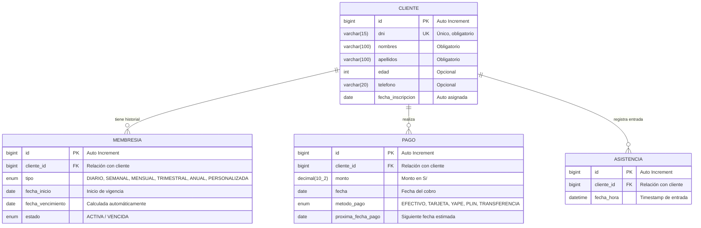

# 🔥 BRUTAL FITNESS — Sistema de Gestión para Gimnasio 🏋️‍♂️

Sistema web integral diseñado para modernizar y digitalizar la administración operativa del gimnasio **BRUTAL FITNESS** (ubicado en el **Jirón José Santos Chocano, Distrito de Jesús Nazareno, Ayacucho**), aplicando la **arquitectura por capas** con **Spring Boot**, **Spring Data JPA**, **Thymeleaf**, **MySQL** y **PostgreSQL**.

---

## 📌 Problemática y Solución

### El Problema
El control tradicional en cuadernos o libretas físicas genera:
* Pérdida o deterioro de la información histórica de clientes y pagos.
* Errores de registro y lentitud al atender en recepción.
* Dificultad para calcular y controlar las fechas de vencimiento de membresías.
* Falta de métricas en tiempo real sobre ingresos y asistencias diarias.

### La Solución
Una plataforma web rápida, segura y automatizada que gestiona clientes, planes de membresía con cálculo dinámico de vigencia, cobros y registro de asistencias en tiempo real.

---

## 🏗️ Arquitectura del Sistema

El proyecto sigue una arquitectura en capas desacoplada y estandarizada:

```
[ Vista (Thymeleaf / HTML5 / Bootstrap 5 / JS) ]
                     ↕
   [ Controller (Spring Web MVC) ]
                     ↕
   [ Service (Lógica de Negocio / Interfaces + Impl) ]
                     ↕
   [ Repository (Spring Data JPA / Queries JPQL) ]
                     ↕
       [ Entity (Modelos JPA) ] ↔ [( Base de Datos MySQL )]
```

---

## 🗄️ Base de Datos y Modelo Entidad-Relación

El sistema utiliza **MySQL 8.x** con el esquema `gym_db`. La base de datos está normalizada y centrada en la entidad `cliente` con relaciones 1:N (uno a varios) hacia membresías, pagos y asistencias.

### Diagrama Entidad-Relación (ERD)



### Scripts SQL Disponibles
El proyecto incluye scripts DDL y datos de prueba listos para importar:
* 👉 **MySQL 8.x**: [`database/gym_db.sql`](database/gym_db.sql)
* 👉 **PostgreSQL 14+**: [`database/gym_db_postgresql.sql`](database/gym_db_postgresql.sql)

---

## 🚀 Módulos y Funcionalidades

### 1. 📊 Panel de Control (Dashboard)
* **Indicadores en tiempo real**:
  * Total de clientes registrados.
  * Membresías activas.
  * Membresías próximas a vencer (alerta a 7 días).
  * Membresías vencidas.
  * Total de ingresos recaudados en el mes en curso (S/).
  * Asistencias registradas en el día.

### 2. 👥 Módulo de Clientes (`/clientes`)
* Registro, edición y eliminación de clientes.
* Validación de DNI único y datos de contacto (teléfono, edad).
* Fecha de inscripción inicializada automáticamente con la fecha actual.
* Buscador interactivo por nombre o apellido.

### 3. 💳 Módulo de Membresías (`/membresias`)
* **Planes soportados**: `DIARIO`, `SEMANAL`, `MENSUAL`, `TRIMESTRAL`, `ANUAL` y `PERSONALIZADA`.
* **Cálculo Automático de Vigencia**:
  * Al seleccionar el plan y la fecha de inicio, la fecha de vencimiento se calcula automáticamente tanto en la interfaz (JavaScript en tiempo real) como en el backend.
  * En modo `PERSONALIZADA`, permite ingresar libremente cualquier fecha manual.
* **Control de Estados**: Actualización automática entre `ACTIVA` y `VENCIDA` según la fecha actual.

### 4. 💵 Módulo de Pagos (`/pagos`)
* Registro de cobros asociados a un cliente y su método de pago (`EFECTIVO`, `TARJETA`, `YAPE`, `PLIN`, `TRANSFERENCIA`).
* Pre-llenado inteligente de fecha de pago y proyección automática de la próxima fecha de pago.
* Cálculo consolidado de recaudación mensual mediante consultas agregadas (`SUM`).

### 5. ⏱️ Módulo de Asistencias (`/asistencias`)
* Registro de entrada por cliente con estampación de fecha y hora exacta (`LocalDateTime`).
* Listado diario cronológico y conteo para el dashboard.

---

## 🛠️ Stack Tecnológico

| Capa / Herramienta | Tecnología |
| :--- | :--- |
| **Lenguaje** | Java 17+ (Compatible con JDK 17, 21 y versiones superiores) |
| **Framework Backend** | Spring Boot 3.3.4 (Spring Web MVC, Spring Data JPA, Spring Validation) |
| **Motor de Plantillas** | Thymeleaf + HTML5 + JavaScript Vanilla |
| **Estilos UI** | Bootstrap 5.3.3 + CSS3 personalizado |
| **Base de Datos** | MySQL 8.x / PostgreSQL 14+ (Soporte Dual con Hibernate ORM) |
| **Gestor de Proyecto** | Apache Maven |

---

## ⚙️ Configuración y Ejecución Local

### 1. Requisitos Previos
* Java Development Kit (JDK 17 o superior).
* Servidor de Base de Datos: **MySQL** (puerto `3306`) o **PostgreSQL** (puerto `5432`).
* Apache Maven (o Maven Wrapper).

### 2. Configuración de Base de Datos

#### Opción A: Usando MySQL (Por Defecto)
En `src/main/resources/application.properties`:
```properties
spring.datasource.url=jdbc:mysql://localhost:3306/gym_db?createDatabaseIfNotExist=true&serverTimezone=America/Lima
spring.datasource.username=root
spring.datasource.password=root
```
*(Importar script opcional: `mysql -u root -p gym_db < database/gym_db.sql`)*

#### Opción B: Usando PostgreSQL
El proyecto cuenta con el perfil `postgres` listo en `src/main/resources/application-postgres.properties`:
```properties
spring.datasource.url=jdbc:postgresql://localhost:5432/gym_db
spring.datasource.username=postgres
spring.datasource.password=postgres
```
*(Importar script opcional: `psql -U postgres -d gym_db -f database/gym_db_postgresql.sql`)*

### 3. Compilar y Ejecutar

```bash
# Compilar el proyecto
mvn clean compile

# Ejecutar con MySQL (por defecto)
mvn spring-boot:run

# Ejecutar con PostgreSQL (usando el perfil postgres)
mvn spring-boot:run -Dspring-boot.run.profiles=postgres
```

### 4. Acceder al Sistema
Abre tu navegador en: **[http://localhost:8080](http://localhost:8080)**

---

## 📁 Estructura del Código Fuente

```
src/main/java/com/pontificia/gym/
 ├── config/            -> Configuración global y manejadores de error
 ├── controller/        -> Controladores Spring MVC (Rutas y Vistas)
 │    ├── HomeController.java
 │    ├── ClienteController.java
 │    ├── MembresiaController.java
 │    ├── PagoController.java
 │    └── AsistenciaController.java
 ├── entity/            -> Modelos JPA (Cliente, Membresia, Pago, Asistencia, Enums)
 ├── repository/        -> Repositorios Spring Data JPA
 └── service/           -> Interfaces de negocio e implementaciones en impl/
src/main/resources/
 ├── templates/         -> Vistas Thymeleaf (clientes, membresias, pagos, asistencias, fragments)
 ├── static/css/        -> Hojas de estilo personalizadas
 └── application.properties
```

---

## 👨‍💻 Autoría y Contexto Académico

* **Gimnasio:** **BRUTAL FITNESS** (Jr. José Santos Chocano, Distrito de Jesús Nazareno, Ayacucho).
* **Institución:** Escuela de Educación Superior Tecnológica Privada **La Pontificia** (Ayacucho, Perú).
* **Asignatura:** *Ingeniería de Sistemas de Información*.
* **Autor / Desarrollador Original:** Mari Chuchón (`mari@lapontificia.edu.pe`).
